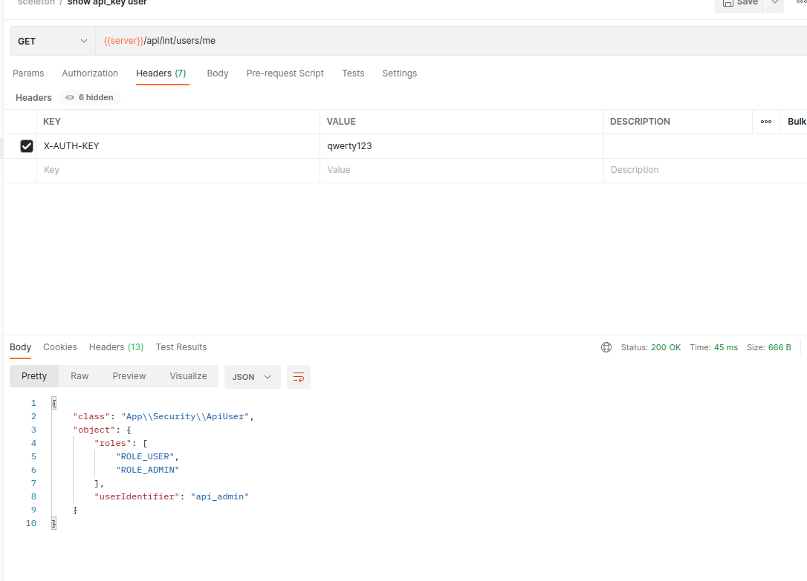

## Installation

________________

Install the latest version with

```bash
$ composer require lotashinski/apikey-security-classes
```

## Usage

_________________

### 1. Create users file:

```yaml
## ./config/service/api_keys.yaml or other

users:

  - user_name: api_admin
    roles: [ 'ROLE_USER', 'ROLE_ADMIN' ]
    api_key: qwerty123

  - user_name: api_user
    roles: [ 'ROLE_USER' ]
    api_key: bbb123
```

### 2. Configure dependency injection

```yaml
## ./config/services.yaml

services:

  Grsu\ApiKeySecurity\ApiKeyAuthentication:
    # for create logger tag
    tags:
      - { name: monolog.logger, channel: ApiKeyAuthenticator }

  Grsu\ApiKeySecurity\ApiKeyUserProvider:
    arguments:
      # path to users file
      $pathToUsersConfig: '%kernel.project_dir%/config/service/api_keys.yaml'
    tags:
      - { name: monolog.logger, channel: ApiKeyUserProvider }
```

### 3. Configure security

```yaml
### ./config/packages/security.yaml

security:

  # ...
  providers:
    # ...
    api_key_user_provider:
      id: Grsu\ApiKeySecurity\ApiKeyUserProvider

  # ...
  firewalls:
    # ...
    api_key:
      pattern: ^/api/int  
      lazy: true
      provider: api_key_user_provider
      custom_authenticator: Grsu\ApiKeySecurity\ApiKeyAuthentication
  
  # ...
  access_control:
    - { path: ^/admin, roles: IS_AUTHENTICATED_FULLY }
```

## Example
```php
    
<?php

namespace App\Controller;

use Symfony\Bundle\FrameworkBundle\Controller\AbstractController;
use Symfony\Component\HttpFoundation\Response;
use Symfony\Component\Routing\Annotation\Route;
use Symfony\Component\Serializer\Normalizer\NormalizerInterface;


class UserController extends AbstractController
{

    #[Route('/api/int/users/me', name: 'api_user_info', methods:['GET'])]
    public function index(NormalizerInterface $normalizer): Response
    {
        $user = $this->getUser();
        return $this->json(
            $normalizer->normalize([
                'class' => get_class($user),
                'object' => $user
            ])
        );
    }
}

```

For request use ```X-AUTH-KEY``` header with ```api_key``` from ```api_users.yaml```.

